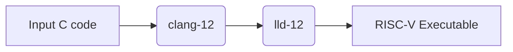
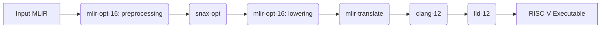

# SNAX-MLIR

Repository for running MLIR compiled stuff on SNAX

General flow:
pytorch -> `torch-mlir` -> linalg dialect -> mlir-opt, mlir-translate, clang -> snax binary

## Requirements

* pytest
* numpy
* [xdsl](https://github.com/xdslproject/xdsl)

## Setup with Docker Container

For compiling the low-level kernels you need the snitch compilation toolchain, 
which is easiest to get through a docker container.

### Getting the container remotely

You can run tests/experiments in this repository with:
```sh
docker run -itv `pwd`:/repo:z ghcr.io/kuleuven-micas/snax-mlir:main
```
This will download the image if it is not present on your system yet.
The repository will be available under `/repo`

To use the custom `snax-opt` compiler across the repo you need to additionaly install it with pip:

```sh
pip3 install -e /repo
```

### Building the container locally (optional)

To build the container locally, you can use the following commands:
```sh
cd container
docker build . -t ghcr.io/kuleuven-micas/snax-mlir:main # optional: --build-arg config=path_to_your_hjson_file.hjson
cd ..
```
Then you can run the experiments with the above `docker run` command

Note: leaving out the `config` `--build-arg` will use the default `snitch_cluster` setup.

## Pytorch -> Linalg

### Run stardew tests

The folder tests include some examples of translating torch models to mlir using the stardew framework.
The python3.11 installation in the docker container comes with all the requirements pre-installed and can be run:

```sh
python3 tests/test_mult.py
```
This will output the final MLIR code.


All tests can be run using pytest:
```sh
pytest tests
```


## Linalg -> Snax

### Run Snax Kernels

Inside the docker container:
```sh
cd /kernels/simple_mult
make allrun
```
This will compile `main.c` two different `kernel`s:

1. `baseline.c`: A C implementation of the kernel
2. `linalg.mlir`: An MLIR Linalg implementation of the kernel

Note that for both kernels, a different lowering path is employed.
All C code is lowered with the same flow (1):

1. c code input

2. mlir input


Note: Due to snitch's dependency on a custom LLVM-12 backend (which does not support LLVM opaque pointers) we are stuck with MLIR version 16.
Opaque pointers were introduced in LLVM 15, and support for typed pointers is removed in LLVM 17. 
More information is available [here](https://llvm.org/docs/OpaquePointers.html).
However, we also need to use MLIR version 18, as our custom `snax-opt` compiler is built upon xDSL, which is based on the latest version of MLIR-18. This results in a combination of llvm versions 12, 16 and 18.
To enable the conversions, we use a couple of conversion scripts:

* `tollvm12.py` converts the LLVM output from mlir-translate from version LLVM 16 to LLVM 12
    * Certain LLVM metadata, introduced by `mlir-translate-16` was only introduced in versions later than LLVM 12, and they would throw an error if they are not removed
* `tomlir16.py` and `tomlir18.py`convert the MLIR code between MLIR 16 and 18, such that we can use our own compiler written based on xDSL.
    * The main difference between MLIR 16 and 18 is the introduction of MLIR properties, and the difference in spelling of `operandSegmentSizes`

### Inspect traces for snax kernels

Tracing tracks individual instructions as they are executed by the RISC-V cores in the snax-cluster.
Therefore tracing requires running a program with a tracer.
The default `allrun` recipe in the makefile runs all examples with a tracer.
To convert the machine-readable traces to human-readable format, use

Inside the docker container:
```sh
cd /kernels/simple_mult
make allrun # If you haven't ran the kernels before
make traces
```
Human readable traces are put in a `.logs` directory with the same name as the kernel binary.
Statistics are computed for each section of the program execution.

Note: In this context a section means a part of the trace as delimited by an `mcycle` instruction.
E.g. calling `mcycle` in a program once will yield two sections, one before the mcycle instruction and one after.

### Inspect disassembly for generated binaries

Disassembly is the conversion of the compiled binary to human-readable form.
In this way you can inspect the program the way it is put into the memory.
```sh
cd /kernels/simple_mult
make baseline.o # Make an object file
/opt/snitch-llvm/bin/llvm-objdump -d baseline.o
```
As you can see, disassembly does not require running the program.

Note: The dissassembly might show multiple "sections". In this context, a section is a unit of information in an ELF-file.
E.g. the `.text` section will container your program and the `.data` section will contain your static data.

