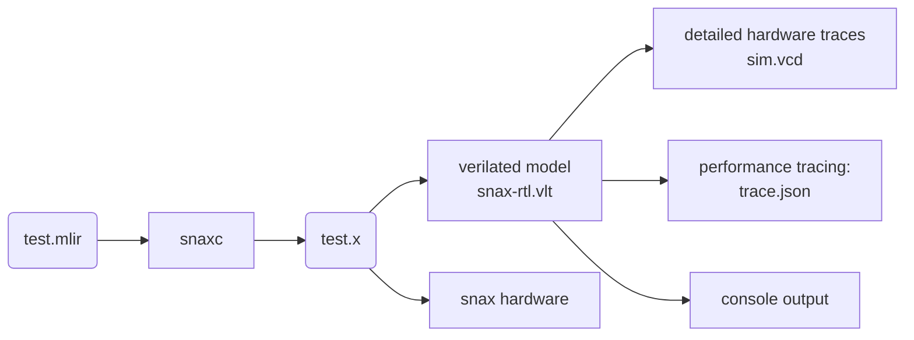

# SNAX-MLIR

In this repository we research an MLIR-based compiler for RISC-V based accelerator platforms developed by KULeuven and friends.
This repository is the home of `snaxc`, the compiler for platforms based on [KULeuven-MICAS/snax_cluster](https://github.com/KULeuven-MICAS/snax_cluster),
based on [xdsl](https://github.com/xdslproject/xdsl) and [MLIR](https://mlir.llvm.org) .

_Heads up: this is research code! We work hard to make it clean and usable, but don't expect the same level of maintenance you'd get from a production library.
Don't hesitate to reach out for any questions, issues or collaboration opportunities, though!_

## Features

The main focus of this project is to enable agile experimentation for more efficient hardware/software codesign.
SNAX-MLIR is the result of many months of work and research, and by now, supports:

* Deployment on SNAX hardware, a RISC-V controlled cluster with highly efficient accelerators.
* Automatic scheduling for reduced scratchpad banking conflicts.
* Automatic accelerator configuration overhead reduction.
* Retargetability for many types of accelerators.
* Optimized static memory allocation using [minimalloc](https://github.com/google/minimalloc) and other allocation algorithms.
* Automatic double buffering for scratchpads.
* ...


## General Flow



The general goal of `snaxc` is to produce a binary that can be run on SNAX hardware.
Don't worry if you don't have physical snax hardware, though!
We run most of our tests in [verilated](https://www.veripool.org/verilator/) (simulation) models anyway.
These simulation models allow you to run snax binaries on your own machine, and furthermore they provide you with:

* Detailed VCD simulation output for hardware designers.
* More specific performance tracing information for hardware/software optimization from hardware performance counters.
* Console output (`printf`) which can be useful for debugging hardware and software.

We provide pre-built models so you can get started quickly; for installation, see [Getting started](#getting-started).
Hardware designers who want to create their own hardware or simulation models should look at
the documentation and example configurations in the [KULeuven-MICAS/snax_cluster](https://github.com/KULeuven-MICAS/snax_cluster) repository.

## Getting started

This repository uses [pixi](https://pixi.prefix.dev) for package management.

1) Clone this repository: `git clone https://github.com/KULeuven-MICAS/snax-mlir`
2) [Install pixi](https://pixi.prefix.dev/latest/installation)
3) Open a pixi shell in the repository: `cd snax-mlir && pixi shell`
(the first invocation of pixi shell might take a while, as it needs to download all packages).

Now you can run one of the examples in `kernels`.
The examples in this repository are written as workflows that compile, run and postprocess programs on the SNAX platform.
The workflows are composed with [`snakemake`](https://snakemake.readthedocs.io/en/stable/).

1) Go to a simple example, for example `cd kernels/streamer_alu`.
   This is a simple example that uses a reconfigurable accelerator to add two vectors.
2) Run the snakemake workflow: `snakemake -c 4 all` (you can replace 4 with the number of threads available on your system).

If all went well, this is what happens:

1) The MLIR file is compiled with `snaxc` into a RISC-V object file (after translation to LLVM, and compilation through `clang`).
2) `gendata.py` generates two data files `data.c` and `data.h` which contain both the input data, and the expected output data.
3) The `main.c` program is compiled with `clang` into an executable `streamer_add.x`. This program copies data from data.h into the right place in memory,
runs the MLIR file as an external function, and if all went well,
it double checks if the result is correct by checking the output values with the expected values.
4) The output executable is run on the pre-built verilated model.
The printf output is printed to the console, and stored in a log file.
The model also outputs trace files for each RISC-V core included in the build (usually there are 2)
5) The output of the model is postprocessed into one json file.

## Information for Developers

This information is for people who wish to dive deeper in the inner workings of the repository and/or for people who wish to contribute.

### Folder structure

This is an overview of the most important files and folders of this repository
```sh
.
├── docs                # Documentation
├── kernels             # Examples of kernels on various accelerators
├── pyproject.toml      # Project info and pixi requirements
├── runtime             # C header files to complement the snax runtime in github.com/KULeuven-MICAS/snax_cluster
├── snaxc               # Python project root
│   ├── accelerators        # Accelerator target information
│   ├── dialects            # SNAXC specific MLIR dialects
│   ├── tools               # Implementation of main compiler drivers, snaxc, snax-opt
│   └── transforms          # MLIR transformation and conversion passes
├── tests               # Unit tests: pytest and LLVM filecheck-style tests
│   ├── dialects            # Python tests for snax-specific dialects
│   └── filecheck           # LLVM filecheck style tests for dialects and passes
└── util                # Various utilities
    ├── snake               # Snakefile utilities
    ├── tracing             # Utilities for working on traces
    └── visualization       # Utilities for visualizing traces
```

### Unit-tests

Similar to [xdsl](https://github.com/xdslproject/xdsl), our repository contains python unit tests and filecheck tests.

Open a pixi shell: `pixi shell`
Python unit tests can simply be run by running `pytest` in the root of the repository
Filecheck tests are run with `lit` : `lit -vv tests/filecheck`

### Contributing

We welcome contributions of any kind.

To make sure new contributions don't get hold up by any checks of our continuous integration pipeline, it is highly recommended to install `pre-commit`.

## Publications using SNAX-MLIR

* [An open-source hw-sw co-development framework enabling efficient multi-accelerator systems](https://arxiv.org/abs/2508.14582)
* [The Configuration Wall: Characterization and Elimination of Accelerator Configuration Overhead](https://dl.acm.org/doi/10.1145/3760250.3762225)
