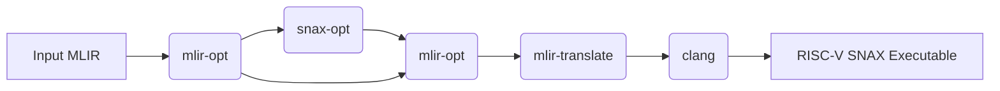
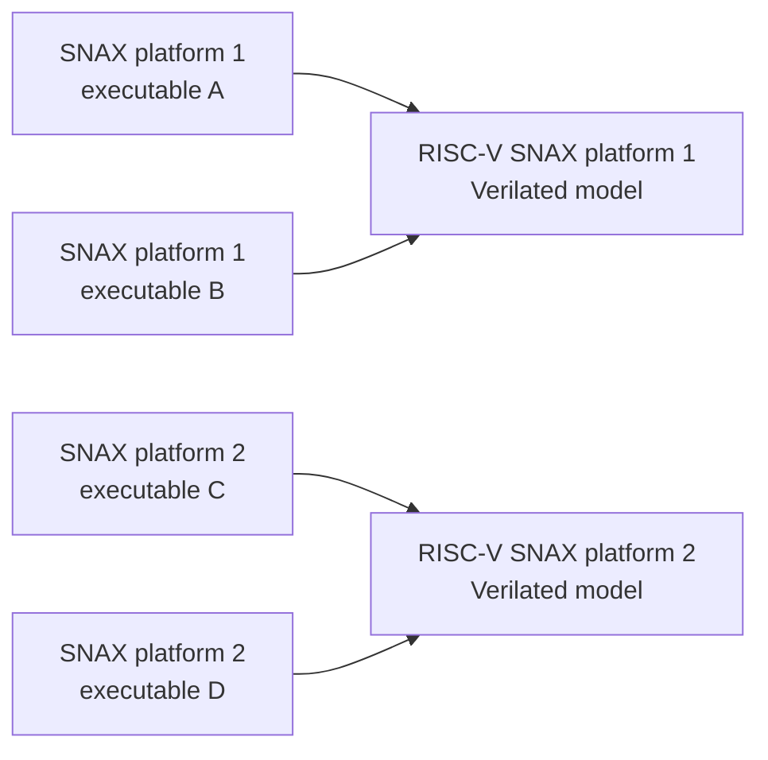

# SNAX-MLIR

Repository for research on an MLIR-based compiler for open-source RISC-V based heterogeneous accelerators platforms developed by KULeuven and friends.
Here `snax-opt` is developed, an [MLIR](https://mlir.llvm.org) compiler in python, based on [xdsl](https://github.com/xdslproject/xdsl).
The open-source hardware that `snax-opt` is targetting is available over at [KULeuven-MICAS/snax_cluster](https://github.com/KULeuven-MICAS/snax_cluster)

_Please note that this repository is currently under heavy development and not ready for general consumption.
We very happily welcome active collaborations and pull requests though!_

General flow:


Example input MLIR is available in the `kernels` folder, it contains:
* Handwritten MLIR tests, mainly `linalg` on `memref`s.
* Scripts to download and build MLPerf Tiny Benchmark tests.

The output binary can be run on a RISC-V RTL simulator through [verilator](https://www.veripool.org/verilator/).
These builds are developed and maintained over at [KULeuven-MICAS/snax_cluster](https://github.com/KULeuven-MICAS/snax_cluster)


## Requirements

This repository has various requirements based on what you want to do:

* Development on `snax-opt` only requires the following python packages: `xdsl`, `lit`, `filecheck` and `pre-commit`. Currently all tests are performed with python 3.10.
* End-to-end compilation of kernels requires all the above packages, and a per-platform customized version of the `snitch_runtime` (`libSnRuntime.a`). 
Furthermore you will need `numpy`, `tensorflow-cpu` (only required for importing MLPerf Tiny Benchmarks in MLIR), `clang`, `mlir-opt`, `mlir-translate` and `make`.
* Running RTL simulations of compiled kernels requires all above dependences, and a build of a verilated model. 
The requirements in this case are specified at [KULeuven-MICAS/snax_cluster](https://github.com/KULeuven-MICAS/snax_cluster).
Tracing requires a custom version of [`spike-dasm`](https://github.com/pulp-platform/riscv-isa-sim).

Unless you are an expert user, we recommend you to use our monolithic docker setup outlined below.
This setup contains all dependencies in the right versions to perform both hardware and software development on SNAX.

## Setup with Docker Container

### Getting the container remotely

You can run tests/experiments in this repository with docker.
For `<docker-version>` we recommend taking note of the docker version currently used in all continuous integration tests (see `.github/workflows/build-and-run-kernels.yml`).

```sh
docker run -itv `pwd`:/repo:z ghcr.io/kuleuven-micas/snax:<docker-version>
```
This will download the image if it is not present on your system yet.
The repository will be available under `/repo` inside the container.

To use the `snax-opt` command you need to additionaly install it with pip:

```sh
pip install -e /repo
```

Make sure all python dependencies are up-to-date with:

```sh
cd /repo
pip install -r requirements.txt
```

### Building the container locally (optional)

To build the container locally, you can get the container from the hardware repository with the following commands:

```sh
git clone git@github.com:kuleuven-micas/snax_cluster
cd snax_cluster
docker build -t ghcr.io/kuleuven-micas/snax:main -f util/container/Dockerfile .
```

Then you can run the experiments with the above `docker run` command

## Running examples on SNAX

### Run Snax Kernels

Inside the docker container:

```sh
cd /repo/kernels/simple_mult
make allrun
```

This will compile `main.c` two different `kernel`s:

1. `baseline.c`: A C implementation of the kernel
2. `linalg.mlir`: An MLIR Linalg implementation of the kernel

The exact invocations of all the compilers can be seen in the terminal

* `tollvm12.py` inserts extra metadata required for clang to compile the binary.

### Inspect traces for snax kernels

Tracing tracks individual instructions as they are executed by the RISC-V cores in the snax-cluster.
Therefore tracing requires running a program with a tracer.
The default `allrun` recipe in the makefile runs all examples with a tracer.
To convert the machine-readable traces to human-readable format, use

Inside the docker container:

```sh
cd /kernels/simple_mult
make allrun # If you haven't ran the kernels before
make traces
```

Human readable traces are put in a `.logs` directory with the same name as the kernel binary.
Statistics are computed for each section of the program execution.

Note: In this context a section means a part of the trace as delimited by an `mcycle` instruction.
E.g. calling `mcycle` in a program once will yield two sections, one before the mcycle instruction and one after.

### Inspect disassembly for generated binaries

Disassembly is the conversion of the compiled binary to human-readable form.
In this way you can inspect the program the way it is put into the memory.

```sh
cd /kernels/simple_mult
make baseline.o # Make an object file
llvm-objdump-17 -d baseline.o
```

As you can see, disassembly does not require running the program.

Note: The dissassembly might show multiple "sections". In this context, a section is a unit of information in an ELF-file.
E.g. the `.text` section will container your program and the `.data` section will contain your static data.
